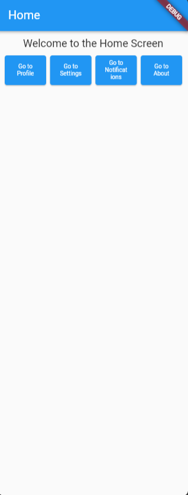
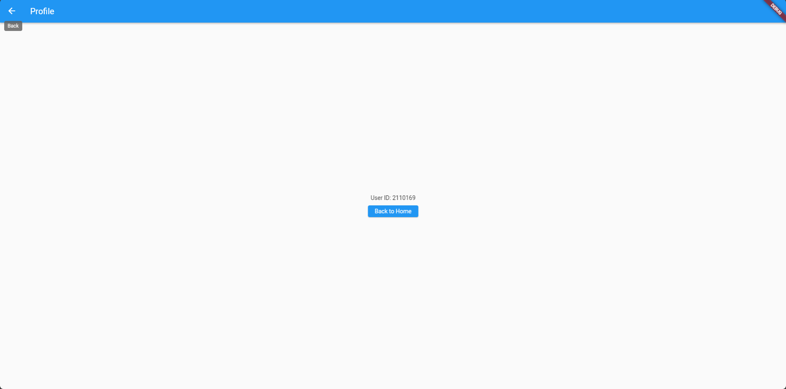
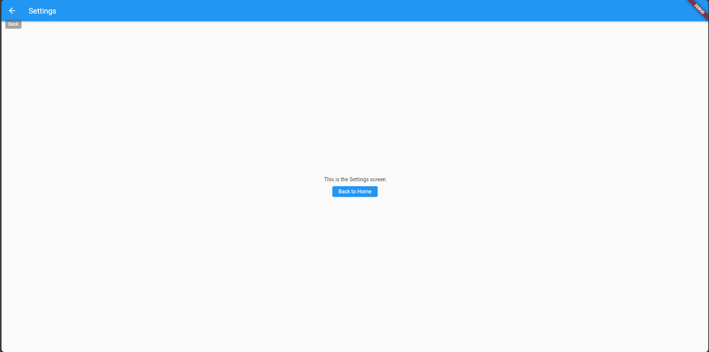

# Navigation and Routing Objective

Navigation and Routing Objective is a Flutter application that serves as a hands-on exercise to practice and understand the concept of navigation and routing in Flutter.

## Features

- **Multiple Screens:** Navigate between Home, Profile, Settings, Notifications, and About screens.
- **Data Passing:** Demonstrate passing data between screens using Navigator.
- **Provider Package:** Implement state management using the Provider package.
- **Result Returning:** Showcase returning results from one screen to another.
- **Responsive UI:** Design a simple and responsive user interface.

## Screenshots

## Getting Started

1. Clone this repository:  
    git clone https://github.com/DiURka/HW3.git
2. Navigate to the project directory:  
    cd hw3
3. Install dependencies:  
    flutter pub get
4. Run the app:  
    flutter run

## Usage

- On the Home screen, click the buttons to navigate to different screens.
- Explore each screen and observe data passing and result returning.
- Enjoy a simple and intuitive user interface.

## Folder Structure
/lib  

/screens  

- HomeScreen.dart  
- ProfileScreen.dart  
- SettingsScreen.dart  
- NotificationsScreen.dart  
- AboutScreen.dart  

/providers  

- AppProvider.dart  

- main.dart  

/screenshots  

- home_screen.png  
- profile_screen.png  
- settings_screen.png  
- notifications_screen.png  
- about_screen.png  

## Code Explanations  
#### main.dart:  

Sets up the main entry point of the application.  
Initializes the Provider package for state management.  
Defines routes for different screens using MaterialApp.  

#### AppProvider.dart:  

Defines the AppProvider class for state management.  
Utilizes the ChangeNotifier class to notify listeners of state changes.  

#### HomeScreen.dart:  

Implements the Home screen with navigation buttons to other screens.  
Uses ElevatedButton widgets for navigation.  
Demonstrates the use of Navigator for screen navigation.  

#### ProfileScreen.dart:  

Implements the Profile screen with data passing from the Home screen.  
Retrieves data using ModalRoute.of(context)?.settings.arguments.  
Uses ElevatedButton for navigation back to the Home screen.  

#### SettingsScreen.dart, NotificationsScreen.dart, AboutScreen.dart:  

Implements Settings, Notifications, and About screens respectively.  
Each screen may contain specific functionalities or information.  

### Happy Coding! 🚀